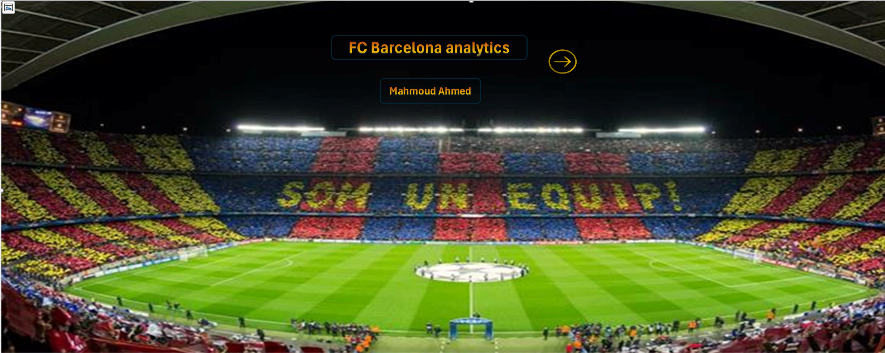
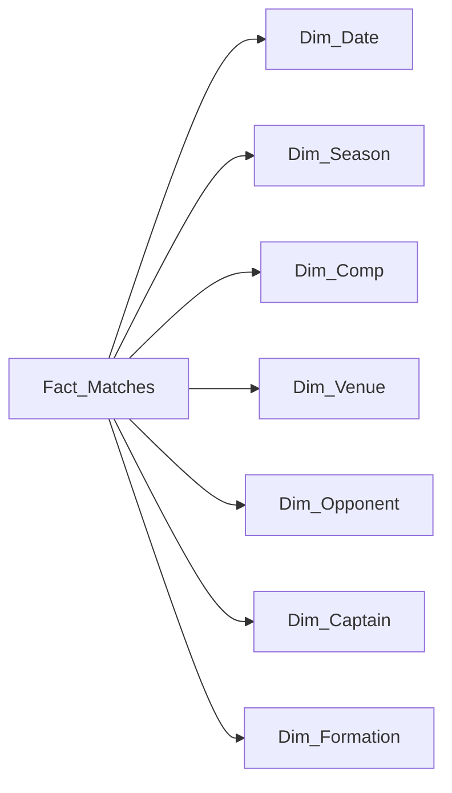

# FC Barcelona Match Analytics — Excel Dashboard



## Project Overview

This project analyzes **562 FC Barcelona matches** played between **11 August 2015 and 25 May 2025**. The Excel solution combines data cleaning, dimensional modeling, PivotTables, slicers, KPI cards, and interactive dashboard pages to explore match results, goals, possession, attendance, formations, competitions, seasons, venues, opponents, and captains.

## Project Objectives

- Track overall team performance and match outcomes.
- Compare goals scored and conceded across seasons and competitions.
- Analyze home, away, and neutral-venue performance.
- Explore possession by formation.
- Identify captains associated with the highest number of wins.
- Monitor attendance trends over time and by venue.

## Tools and Techniques

- Microsoft Excel
- Power Query for data preparation
- Power Pivot / Excel Data Model
- Star-schema data modeling
- PivotTables and PivotCharts
- Interactive slicers
- KPI calculations and dashboard design

## Data Model

The workbook contains a central match fact table connected to multiple dimension tables.



### Workbook Structure

| Sheet | Purpose |
|---|---|
| `Row Data` | Original match-level data |
| `All Data` | Cleaned and enriched analysis table |
| `Fact_Matches` | Central fact table containing match measures and foreign keys |
| `Dim_Date` | Date, time, month, and quarter attributes |
| `Dim_Comp` | Competition dimension |
| `Dim_Venue` | Venue dimension |
| `Dim_Captain` | Captain dimension |
| `Dim_Season` | Season dimension |
| `Dim_Opponent` | Opponent dimension |
| `Dim_Formation` | Formation dimension |
| `Pivot_Tables` | Supporting PivotTables for dashboard visuals |
| `KPIs` | Main KPI calculations |
| `Home_Page` | Project landing page |
| `Page1` / `Page2` | Interactive dashboard pages |
| `Key_Notes` | Supporting project notes |

## Main KPIs

| Metric | Value |
|---|---:|
| Matches | 562 |
| Goals scored | 1,320 |
| Goals conceded | 571 |
| Goal difference | +749 |
| Wins | 373 |
| Draws | 99 |
| Losses | 90 |
| Win rate | 66.4% |

## Key Insights

1. **Strong overall results:** Barcelona won **373 of 562 matches**, producing a **66.4% win rate** and a goal difference of **+749**.
2. **Home advantage was substantial:** the team won **74.7% of home matches**, compared with **58.4% away**.
3. **La Liga represented the largest share of the dataset:** **380 matches**, **263 wins**, **907 goals scored**, and **348 conceded**.
4. **The 2024/2025 season had the highest goals scored:** **174 goals in 60 matches**. The 2015/2016 season delivered the best goal difference at **+116**.
5. **The 4-3-3 formation was the dominant system:** used in **374 matches**, with an average possession of **65.2%** and **250 wins**.
6. **Lionel Messi was the captain in the highest number of wins:** **130 wins across 188 matches**. This is descriptive association and should not be interpreted as causation.

## Dashboard Analysis Areas

The workbook contains visuals for:

- Top captains by wins
- Goals scored and conceded by competition
- Match outcomes by competition
- Goals scored and conceded by season
- Attendance by year and venue
- Average possession by formation
- Overall result distribution

Slicers allow the dashboard to be filtered by **competition**, **season**, and **venue**.

## Data Quality Check

The curated `All Data` table contains:

- 562 match records
- 562 unique match IDs
- No duplicate match IDs
- No blank values across the 16 analysis fields
- A date range from August 2015 to May 2025

## How to Use

1. Download `FC_Barcelona_Match_Analytics.xlsx`.
2. Open it using the desktop version of Microsoft Excel.
3. Enable workbook content and refresh connections if Excel requests permission.
4. Open the dashboard pages and use the slicers to explore the data.

> The workbook uses Excel Data Model, Power Query, PivotTables, and PivotCharts. Some features may not work correctly in browser-based spreadsheet viewers.

## Repository Files

```text
fc-barcelona-match-analysis-excel/
├── FC_Barcelona_Match_Analytics.xlsx
├── README.md
├── DATA_DICTIONARY.md
├── CV_DESCRIPTION.md
├── PUBLISHING_CHECKLIST_AR.md
├── .gitignore
└── images/
    └── cover.png
```

## Data Source Note

The match-level dataset is included inside the workbook. The original external download URL was not embedded in the submitted file and should be added here when available.

## Author

**Mahmoud Ahmed**

- GitHub: [Nagato1pain2](https://github.com/Nagato1pain2)
- LinkedIn: [Mahmoud Ahmed — Data](https://www.linkedin.com/in/mahmoud-ahmed-data/)
- Email: [mahmoudahmed1147@gmail.com](mailto:mahmoudahmed1147@gmail.com)
- Phone: 01010700943
